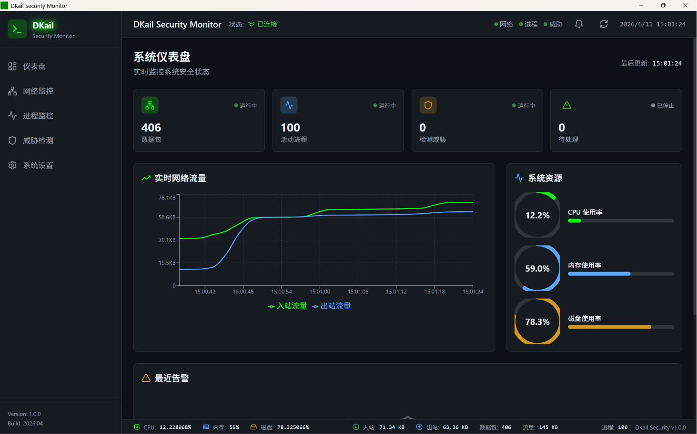
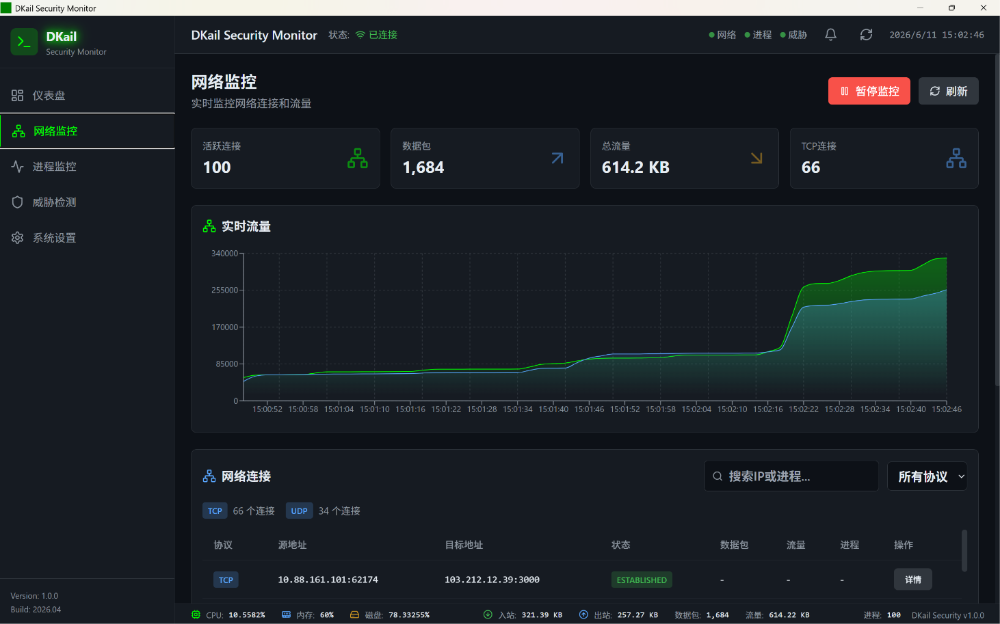
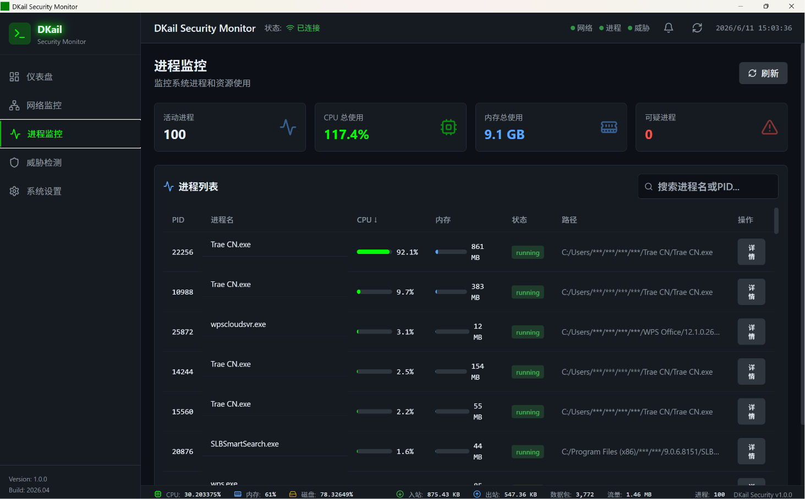
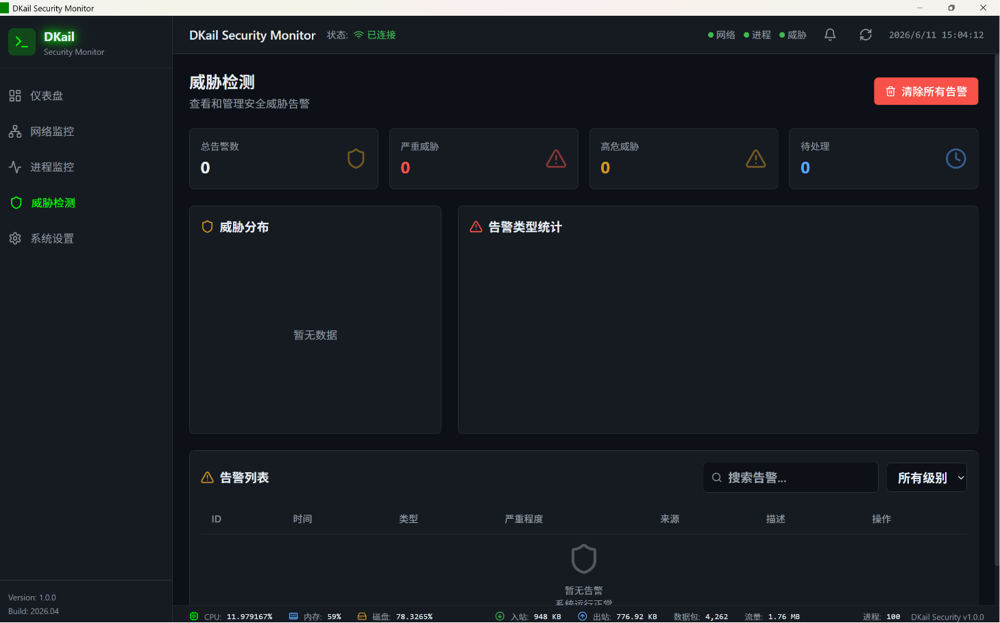

# DKail Security Monitor

一款面向安全学习场景的轻量级主机安全监控系统，提供实时网络流量监控、进程监控、系统资源监控及威胁检测功能，打包为原生桌面应用。

## 功能特性

- **系统资源监控** — CPU、内存、磁盘实时监控与可视化
- **网络流量监控** — 实时网络速率、连接状态、数据包解析
- **进程监控** — 进程列表、CPU/内存占用、异常检测
- **威胁检测** — 可疑连接识别、异常进程告警、安全评分

## 技术栈

| 层级 | 技术 |
|------|------|
| 后端 | Java 17 + Spring Boot 3.2 + Pcap4J + JNA |
| 前端 | React 18 + TypeScript + Zustand + Tailwind CSS |
| 桌面端 | Tauri 2 (Rust) |
| 平台 | Windows |

## 快速开始

### 环境要求

| 环境 | 必需？ | 说明 |
|------|--------|------|
| [Java 17+](https://adoptium.net/) | 必需 | 运行后端 JAR |
| [Npcap](https://npcap.com/) | 推荐 | 网络抓包驱动；未安装时自动降级为 netstat 模式（连接信息受限） |
| WebView2 | 通常已自带 | Windows 10/11 预装；老版本 Windows 需手动安装 |

### 方式一：下载安装包（推荐）

前往 [Releases](https://github.com/chenlong548/Dkail-java/releases) 下载最新版本：

| 文件 | 说明 |
|------|------|
| `DKail-Backend-v1.0.0.jar` | 后端服务 |
| `DKail-Security-Monitor_1.0.0_x64-setup.exe` | NSIS 安装包（推荐） |
| `DKail-Security-Monitor_1.0.0_x64_en-US.msi` | MSI 安装包 |

启动步骤：

```bash
# 1. 启动后端
java -jar DKail-Backend-v1.0.0.jar

# 2. 运行桌面应用（双击安装后的快捷方式，或直接运行 dkail-ui.exe）
```

### 方式二：从源码构建

```bash
# 克隆仓库
git clone https://github.com/chenlong548/Dkail-java.git
cd Dkail-java

# 构建后端
mvn clean package -DskipTests
java -jar target/dkail-1.0.0.jar

# 构建前端 & 桌面应用
cd dkail-ui
npm install
npm run tauri build
```

> 详细的开发流程、环境安装、构建步骤请参阅 [开发与安装手册](开发与安装手册.pdf)

## 项目结构

```
Dkail-java/
├── src/main/java/com/dkail/     # Java 后端源码
│   ├── controller/               # REST API 控制器
│   ├── model/                    # 数据模型
│   └── service/                  # 核心监控服务
├── src/main/resources/           # 配置文件
├── dkail-ui/                     # React + Tauri 前端
│   ├── src/                      # 前端源码
│   └── src-tauri/                # Tauri 桌面端配置
├── assets/screenshots/           # 界面截图
├── pom.xml                       # Maven 配置
├── 开发与安装手册.html             # 开发手册 (HTML)
└── 开发与安装手册.pdf             # 开发手册 (PDF)
```

## 界面预览

<p align="center">
  
  
</p>
<p align="center">
  
  
</p>

## 开发者

- **陈美龙** — 开发者
- **范心予、弓锦添、许堉红、漆清秀** — 小组成员

## 许可证

[MIT License](LICENSE)
